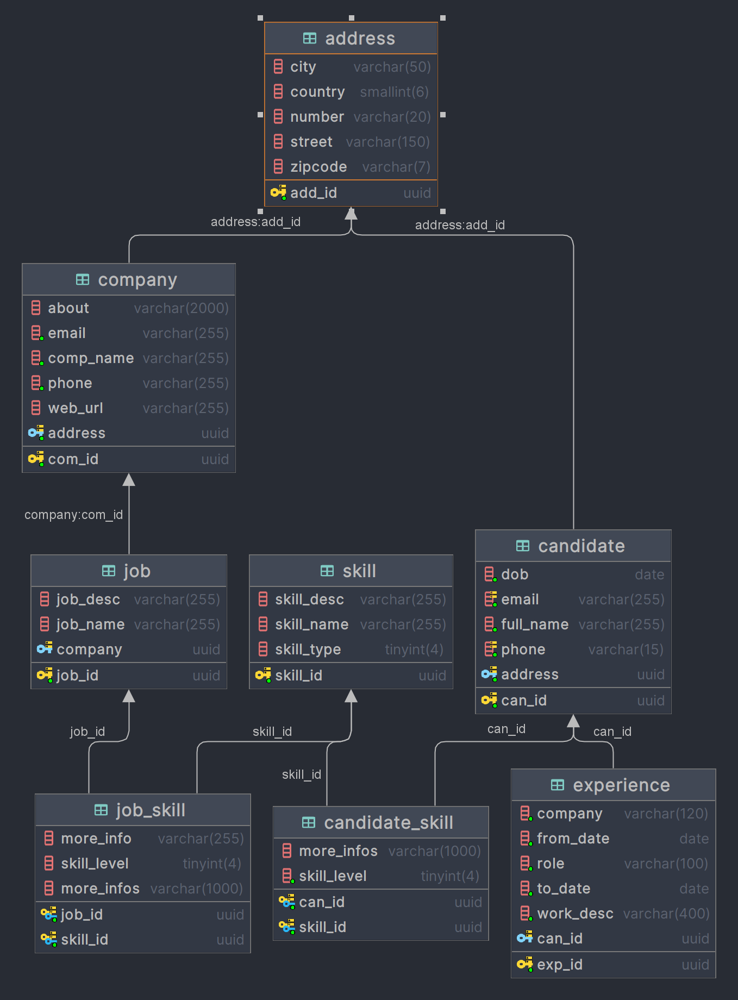

## Lab week 4 WWW

### Mô hình database

### Mô hình lớp

### Chức năng
CRUD với các lớp bên trên
### Sử dụng Generic với lớp AbstractDAO

### Sử dụng RowMapper để chuyển đổi dữ liệu từ câu query select thành các đối tượng

